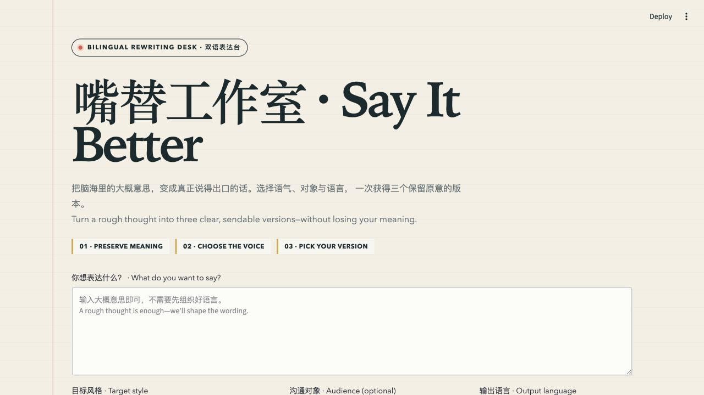

# Say It Better

[](https://say-it-better-duke.streamlit.app/)

Say It Better is a bilingual rewriting assistant that turns a rough thought
into three clear alternatives for a selected style, audience, and output
language. It uses Duke University's OpenAI-compatible AI Gateway and is
available through both a Streamlit interface and a standalone command-line
program.

- **Live app:** <https://say-it-better-duke.streamlit.app/>
- **Source repository:** <https://github.com/YongrongLu/say-it-better>



## Features

- Rewrites text in Chinese or English, regardless of the input language.
- Offers ten styles: angry, sarcastic, passive-aggressive, polite, warm,
  direct, formal, academic presentation, resume, and job interview.
- Adapts wording for a general audience, friend, colleague, manager,
  professor, or recruiter/interviewer.
- Returns three meaning-preserving candidates from one API request:
  **Concise**, **Natural**, and **Complete**.
- Displays the results as individual cards and a formatted comparison table.
- Uses the same reusable API function in the CLI and Streamlit application.
- Handles invalid input, missing configuration, authentication failures,
  rate limits, timeouts, connection errors, and malformed model output.

## How It Works

```text
Streamlit UI (app.py) -----------\
                                  > rewrite_text() in cli_demo.py
Standalone CLI (cli_demo.py) ----/             |
                                                v
                                   Duke AI Gateway / OpenAI SDK
                                                |
                                                v
                                  Three structured rewrite variants
```

`cli_demo.py` is the API layer. It validates the input, builds the prompt,
calls Duke AI Gateway, parses the structured response, and returns the three
variants. It can run independently in a terminal. `app.py` imports the same
`rewrite_text()` function and presents the results in Streamlit.

The prompt treats user text as content rather than instructions, preserves the
user's core meaning, and prevents academic or career modes from inventing
citations, experience, achievements, skills, or metrics.

## Technology

- Python 3.11 or newer
- Streamlit
- OpenAI Python SDK
- Duke AI Gateway
- python-dotenv
- pytest

The deployed application uses Python 3.12 and the `gpt-5.6-sol` model through
Duke AI Gateway.

## Run Locally

### 1. Clone the repository

```bash
git clone https://github.com/YongrongLu/say-it-better.git
cd say-it-better
```

### 2. Create and activate a virtual environment

```bash
python3 -m venv .venv
source .venv/bin/activate
```

### 3. Install dependencies

```bash
python -m pip install --upgrade pip
python -m pip install -r requirements.txt
```

### 4. Configure Duke AI Gateway

Create a local environment file from the safe example:

```bash
cp .env.example .env
```

Open `.env` and add an active Duke AI Gateway token:

```dotenv
LITELLM_TOKEN=replace_with_your_duke_gateway_token
LITELLM_MODEL=gpt-5.6-sol
```

The application calls the OpenAI-compatible endpoint at
`https://litellm.oit.duke.edu/v1`. Never commit `.env` or place a real token in
source code, documentation, screenshots, or terminal recordings.

### 5. Start Streamlit

```bash
python -m streamlit run app.py
```

Open <http://localhost:8501> if the browser does not open automatically.

## Run the CLI

With the virtual environment active and `.env` configured, run:

```bash
python cli_demo.py
```

The CLI prompts for:

1. The meaning to rewrite
2. A target style
3. An audience
4. Chinese or English output

It then prints the same three candidates produced by the web application. The
CLI is a separate terminal program; it does not start Streamlit.

## Run the Tests

```bash
python -m pytest -q
```

The test suite covers input validation, prompt constraints, response parsing,
model configuration, Duke Gateway client construction, API error handling,
CLI behavior, comparison-table data, and a Streamlit smoke test. Gateway calls
are mocked, so the tests do not use API credits.

## Deploy on Streamlit Community Cloud

1. Sign in at <https://share.streamlit.io> with GitHub.
2. Create an app from `YongrongLu/say-it-better`.
3. Select the `main` branch and `app.py` as the entrypoint.
4. Use Python 3.12.
5. Add these root-level values under **Advanced settings > Secrets**:

```toml
LITELLM_TOKEN = "paste_your_real_duke_gateway_token_here"
LITELLM_MODEL = "gpt-5.6-sol"
```

6. Deploy the app and confirm that it is publicly accessible in a private or
   incognito browser window.

Streamlit exposes root-level secrets as environment variables, allowing the
same API layer to run locally and in Community Cloud without committing a
credential.

## Course Requirements Covered

| Requirement | Implementation |
| --- | --- |
| Real API | Duke AI Gateway through the OpenAI Python SDK |
| Reusable API layer | `rewrite_text()` is defined in `cli_demo.py` and imported by `app.py` |
| Standalone CLI | `python cli_demo.py` accepts terminal input and prints text results |
| User input | Text area plus style, audience, and language selectors |
| Dynamic output | Three rewrites change according to the selected options |
| Visual element | Result cards and a formatted comparison table |
| Deployment platform | Streamlit Community Cloud |
| Secret protection | Local `.env`, cloud Secrets, and `.gitignore` |

This repository was completed as an instructor-approved individual project
because the author joined the course after teams had already been formed. The
implementation, testing, documentation, and deployment contributions therefore
appear under one GitHub account.

## Project Structure

```text
say-it-better/
|-- app.py
|-- cli_demo.py
|-- requirements.txt
|-- pyproject.toml
|-- .env.example
|-- .gitignore
|-- assets/
|   `-- app-demo.png
`-- tests/
    |-- test_app.py
    `-- test_cli_demo.py
```

- `app.py`: Streamlit interface, result cards, and comparison table.
- `cli_demo.py`: API function, validation, prompt construction, response
  parsing, user-facing errors, and standalone CLI.
- `tests/`: mocked API tests, CLI tests, validation tests, and Streamlit smoke
  tests.
- `requirements.txt`: runtime and test dependencies.
- `.env.example`: safe environment-variable names and example values.
- `assets/app-demo.png`: interface screenshot used in this README.

## Safety and Privacy

- Do not enter API keys or highly sensitive personal information as rewrite
  content.
- Emotional styles may be sharp, but the application avoids threats, hateful or
  discriminatory language, and severe personal abuse.
- Academic and career styles do not invent claims, evidence, qualifications, or
  performance metrics.
- API credentials are loaded from local environment variables or Streamlit
  Community Cloud Secrets and are never hard-coded.

## Troubleshooting

- **Missing token:** Confirm that `.env` exists locally or that
  `LITELLM_TOKEN` is present in Streamlit Community Cloud Secrets.
- **Unauthorized token:** Verify that the Duke AI Gateway token is active and
  copied correctly.
- **Rate or usage limit:** Check Duke AI Gateway usage and try again later.
- **Timeout or connection failure:** Check the network connection and retry.
- **Unreadable response:** Generate again; the model response did not match the
  required three-variant structure.
